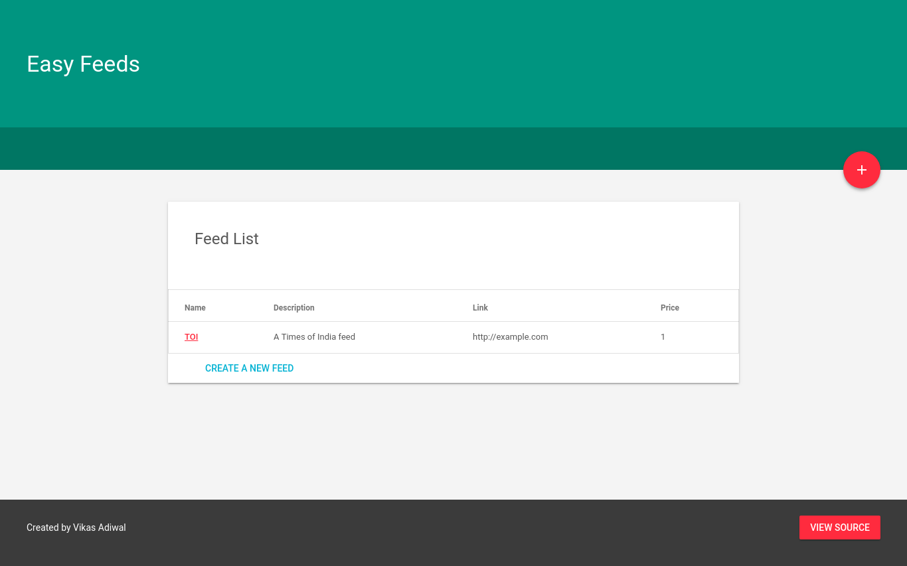
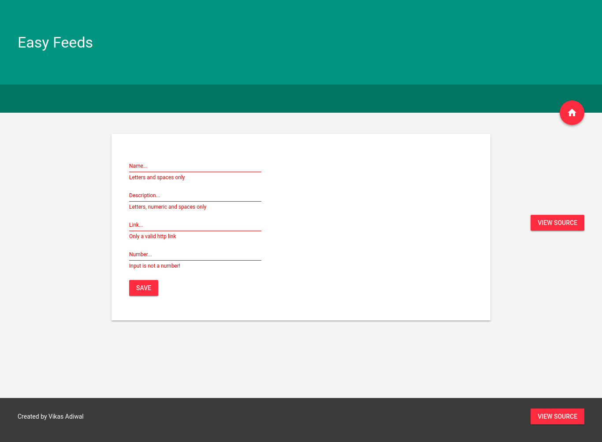
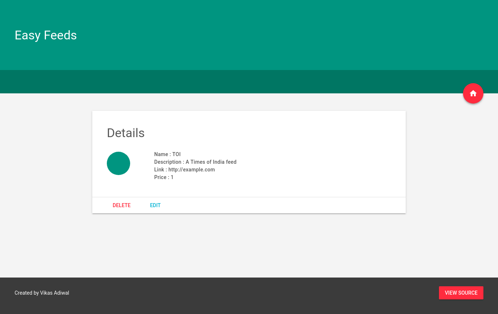

# EASY FEEDS

> A simple application to perform CRUD operations on Mongodb


## Usage

```
$ npm start
```


# Screenshots

## Homepage



## Create new Feed Page



## Detailed View of the Feed



## Edit Existing Feed

